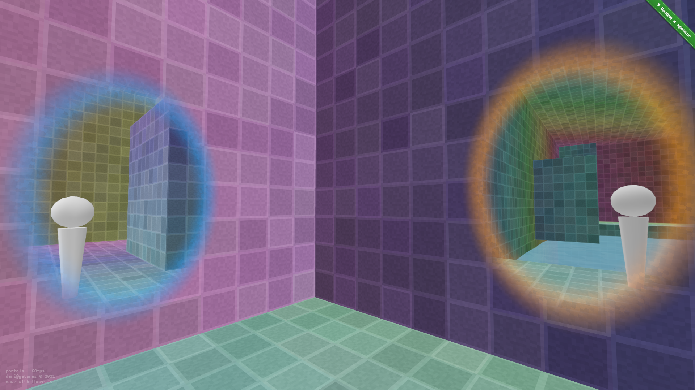

[portals](https://portals.gatunes.com/)
==

[](https://portals.gatunes.com/)

> Portals with ThreeJS

## webxr todo

- need to add xr controller support for creating the portal
- it seems a little slow (laggy) on the oculus quest 2
- throws errors: _gl.drawBuffers( _currentDrawBuffers ); on oculus quest 2 in oculus browser

#### Dev environment

```bash
# clone this repo
git clone https://github.com/danielesteban/portals.git
cd portals
# install dev dependencies
npm install
# start the dev environment:
npm start
# Open http://localhost:8080/ in your browser
```
